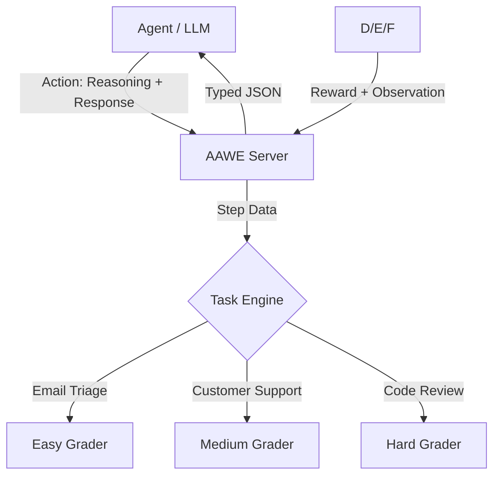

<div align="center">
  <h1>🚀 Adaptive AI WorkOps Environment (AAWE)</h1>
  <h3>Simulation of Real-World AI Workplace Dynamics for the Meta OpenEnv RL Challenge</h3>

  [](https://opensource.org/licenses/MIT)
  [](https://www.python.org/downloads/)
  [](https://github.com/meta-llama/openenv)
  [](https://huggingface.co/spaces/arpitkhandelwal810/Meta-Env-Hackthon)

  **Overview** | **Tasks** | **Architecture** | **Quick Start** | **Evaluation**
</div>

---

## 📖 Overview
**AAWE** is a production-grade, multi-step Reasoning-Action (ReAct) simulation environment. It presents agents with tasks encountered in real office workflows—**Email Triage**, **Customer Support**, and **Code Review**—where failure to reason leads to stagnated results.

### ✨ Key Features
- 🧠 **Deep Reasoning Integration**: Observations require multi-step planning and state management.
- 📈 **Adaptive Difficulty**: Dynamically switches to "Hard Mode" based on agent performance.
- 📊 **Programmatic Grading**: Deterministic scoring (0.0 to 1.0) with granular feedback.
- 🐳 **Dockerized Deployment**: Fully compatible with Hugging Face Spaces (2 vCPU / 8 GB).

---

## 📋 Tasks

| Task ID | Level | Objective | Expected Baseline |
| :--- | :--- | :--- | :---: |
| `email_triage` | 🟢 **Easy** | Classify urgency & suggest immediate actions. | 0.92 |
| `customer_support` | 🟡 **Medium** | Empathy-driven conflict resolution & policy sync. | 0.78 |
| `code_review` | 🔴 **Hard** | Security vulnerability detection & bug hunting. | 0.65 |

---

## 🏗️ Architecture



---

## 🛠️ Quick Start

### 1. Local Setup
```bash
# Clone
git clone https://github.com/arpittkhandelwal/Meta-Env-Hackthon.git
cd Meta-Env-Hackthon

# Install
pip install -r requirements.txt
pip install -e .

# Launch Server
server
```

### 2. Running Evaluation (Inference)
Maintain high-quality logs for judging with the built-in inference script:
```bash
export HF_TOKEN="your_hf_token"
python inference.py
```

---

## 🔐 Configuration

| Variable | Description | Default |
| :--- | :--- | :--- |
| `HF_TOKEN` | Hugging Face Access Token | (Required) |
| `API_BASE_URL` | LLM Gateway Endpoint | `https://api.openai.com/v1` |
| `MODEL_NAME` | Model ID for testing | `gpt-4o-mini` |

---

## 🧪 OpenEnv Compliance
> [!IMPORTANT]
> This environment is built specifically for the **Meta OpenEnv RL Challenge**. It implements the mandatory `reset`, `step`, and `state` interfaces and passes all `openenv validate` checks.

<div align="center">
  <sub>Built with ❤️ for the AI Community.</sub>
</div>
